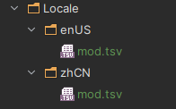
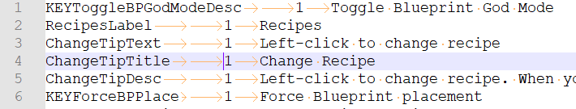

# Localization Module
Localization module allows to add new translations, add new translation keys and edit existing translations.

## Example usage
Make sure to add `[CommonAPISubmoduleDependency(nameof(LocalizationModule))]` to your plugin attributes. This will load the submodule.

## Adding new translations
There are multiple ways of adding translations.

### Through method calls
using method `RegisterTranslation()`. This method is useful if you don't have a lot of strings. Example:

```cs
LocalizationModule.RegisterTranslation(
        "copperWireDesc",
        "By extruding copper we can make a component which allows current to be carried");
```

### By loading a set of localization files.

To do this make the following structure in your plugin folder:

<br>

You can use language ids or abbreviations, whichever you like most. For example enUS id is `1033`. For modded languages, abbreviations are the only option.

Inside language folders you need to add at least one file (Can be named freely, including file extension) as you want with following structure:

<br>

There shouldn't be any headers, and in total 4 values tab separated. First is key, and last is the translation. 2'nd and 3'rd values aren't used, and only exist for compatibility with vanilla format.

Then in your plugin awake do this:

```cs
string pluginfolder = Path.GetDirectoryName(Assembly.GetExecutingAssembly().Location);
string localePath = Path.Combine(pluginfolder, "Locale");

LocalizationModule.LoadTranslationsFromFolder(localePath);
```

### From raw data strings
This method can be useful if you want to load translations from a bundle. To do that, read all text of your files and call this method in your awake method:

```cs
var rawString = "bla bla"; // load the raw string data here
LocalizationModule.LoadTranslationsFromString(rawString, "enUS");
```

The raw string must follow the same format, as described in the file section.

## Adding custom languages
Localization module supports adding new languages, to do that in your plugin awake call:

```cs
LocalizationModule.AddLanguage(new Localization.Language()
{
    name = "German",
    abbr = "deDE",
    abbr2 = "de",
    fallback = Localization.LCID_ENUS,
    glyph = Localization.EGlyph.Latin
});
```

From here you can add translations using all ways by using `deDE` abbreviation as the key or folder name. By doing this you can even add custom localizations for the game.

## Editing existing localizations
Localization module also allows to edit existing localizations. To do so write this in your plugin awake:

```cs
LocalizationModule.EditTranslation("非常困难", "Very Easy!");
```
The localization must already exist, for this to work. You also can edit other mods localizations.
